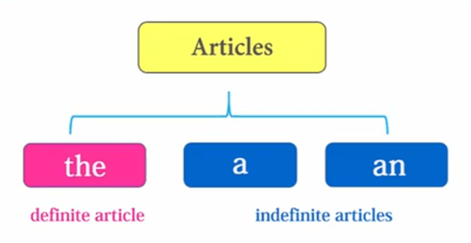
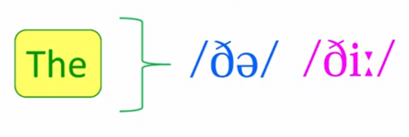
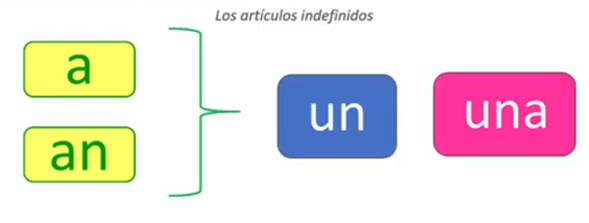
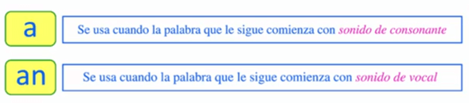
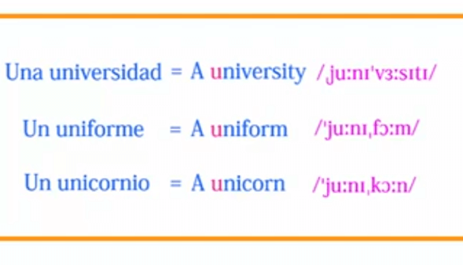

# Artículos

El **artículo** es la palabra que acompaña al sustantivo y **siempre** va delante de él. Se clasifican en **Artículos Definidos** e **Indefinidos**.

## Artículo Definido
**"The"** es el artículo definido en inglés y es invariable: sirve para género masculino, femenino, singular y plural. 
A diferencia del español (el, la, los, las), en inglés no cambia, Por lo Tanto, en inglés solo existe **UN** artículo definido **the** (el, la, los, las).

## Pronunciación de "The"

- **/ði/** → suena como **"di"** en español
  - Antes de **vocal**: the assistant, the email, the office
  
- **/ðə/** → suena como **"de"** en español (sonido suave)
  - Antes de **consonante**: the charger, the salary, the building

## Regla de Uso

| Artículo | Cuándo usar | Ejemplo |
|----------|-------------|---------|
| **a / an** | Primera mención (algo nuevo) | "Paul sent **an** email" |
| **the** | Ya mencionado o conocido | "**The** email had updates" |

## Ejemplos Practicados

1. ✅ "We have **a** small office... **the** office is modern"
2. ✅ "Paul sent **an** email... **the** email had updates"
3. ✅ "Chandler bought **a** chair... **the** chair is expensive"
4. ✅ "**The** client needs **a** solution... **the** solution must be simple"
5. ✅ "I go to **a** Mexican restaurant... **the** restaurant is amazing"

# Artículos Indefinidos
Los artículos indefinidos también son invariables: sirven para género masculino, femenino y singular (un, una). 
Solo existen **DOS** artículos indefinidos en inglés: **a** y **an**.

# Excepciones

La regla de "a" vs "an" depende del **sonido** inicial, no de la letra escrita.

